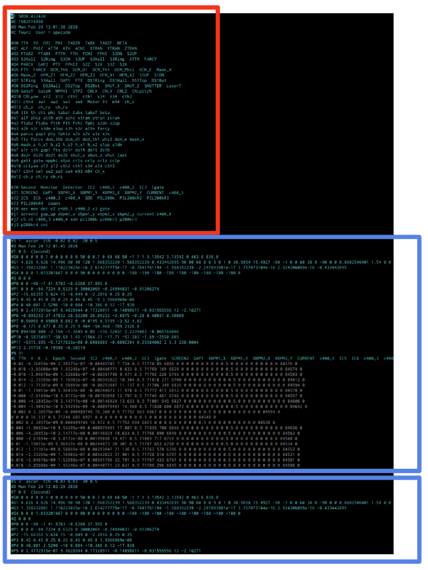
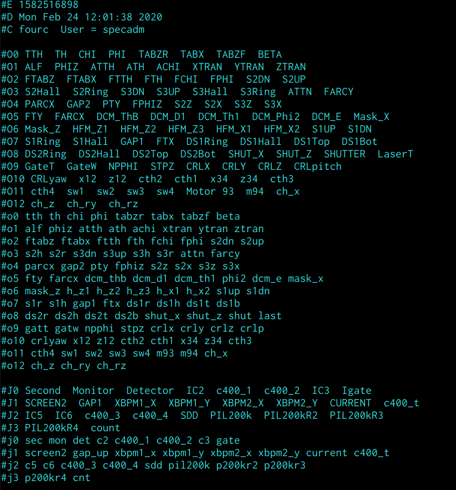
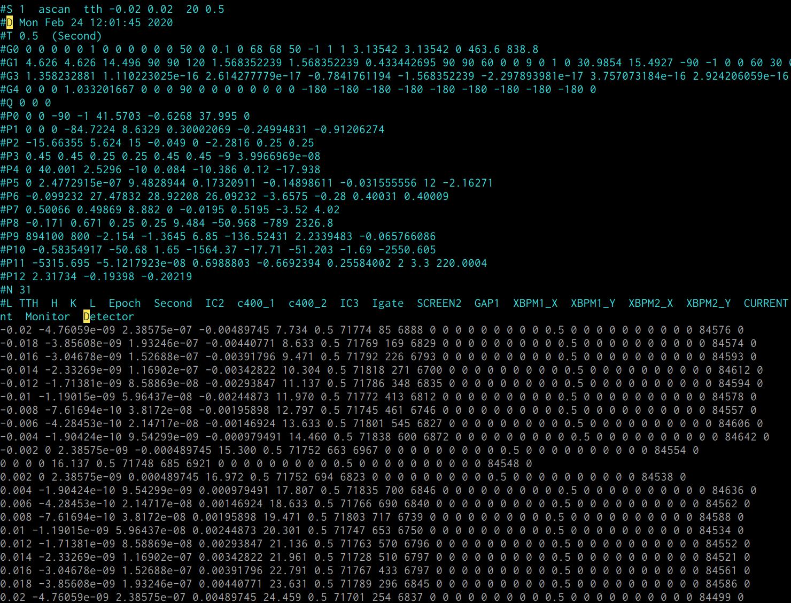

# FourC file 檔案結構說明

FourC 檔案的結構由一個 Header 區塊和多個 Scan 區塊所組成。而其他註解訊息會記錄在在區塊與區塊之間。

如下圖為一個 FourC 檔案開頭。紅色線框起的部份就是 Header 區塊，該區塊在建檔時期就產生。接著每執行一次 scan 指令就會隨之產生一個 Scan 區塊記錄量測資料(藍色線框起來的部份)。

 

# Header 區塊

下圖顯示一個 FourC 檔案的 Header 區塊的樣子。可以看到一行一行的訊息，每一行的開頭會由一個 "#" 加上一個英文字母表示該行的定義。 

 

    #F <FourC 檔案的建檔名稱>

    #E <建檔時的 timestamp>

    #D <日期時間訊息; 這裡記錄開檔的時間>

    #C <註解訊息，結構不一定>

    #O0~ : 一個大寫的 O 加上由 0 開始的整數, 用來記錄馬達名稱。
    #o0~ : 一個大寫的 O 加上由 0 開始的整數, 用來記錄馬達變數名稱。
    #O0, 和#o0 開頭記錄的訊息會 one by one 的對應到每個 Scan 區塊的 #P0 訊息。

    #J0 和 #j0 : 用來記錄 Detector 的名稱與變數名稱。

# Scan 區塊

下圖顯示一個 FourC 檔案的 Scan 區塊的樣子。每一行的開頭會由一個 "#" 加上一個英文字母表示該行的定義。 

 

結構說明如下

    #S <scan_no> <scan 指令>

    #D <日期時間訊息; 記錄 scan 開始的時間>

    #T <積分時間>

    #G0~ : 一個大寫的 G 加上由 0 開始的整數, 用來記錄當下的一些系統變數值。
    ----------------------------------------------------------------------
    #G1 : 記錄 lattice constant 相關的系統變數值
    #G3 : 記錄 UB matrix 變數值
    #G4 : 記錄 波長、與其他系統變數值

    #Q <H> <K> <L>

    #P0~ : 記錄開始 scan 前的馬達位置。對應 Header 區的 #O0~, #o0~ 。

    #N <該次 Scan 的點數>

    #L : 該次 Scan 時會記錄下來的馬達位置、對應倒晶格空間位置、detector 測得的名稱。

    ...<一堆數字。Scan 的每個點的量測值>

